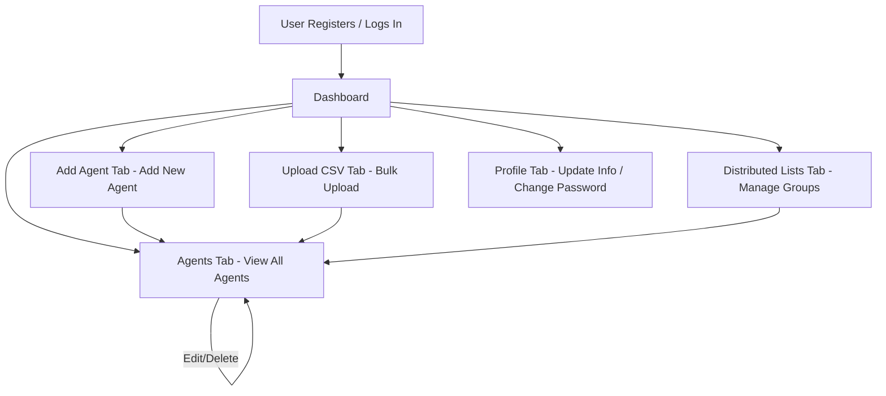
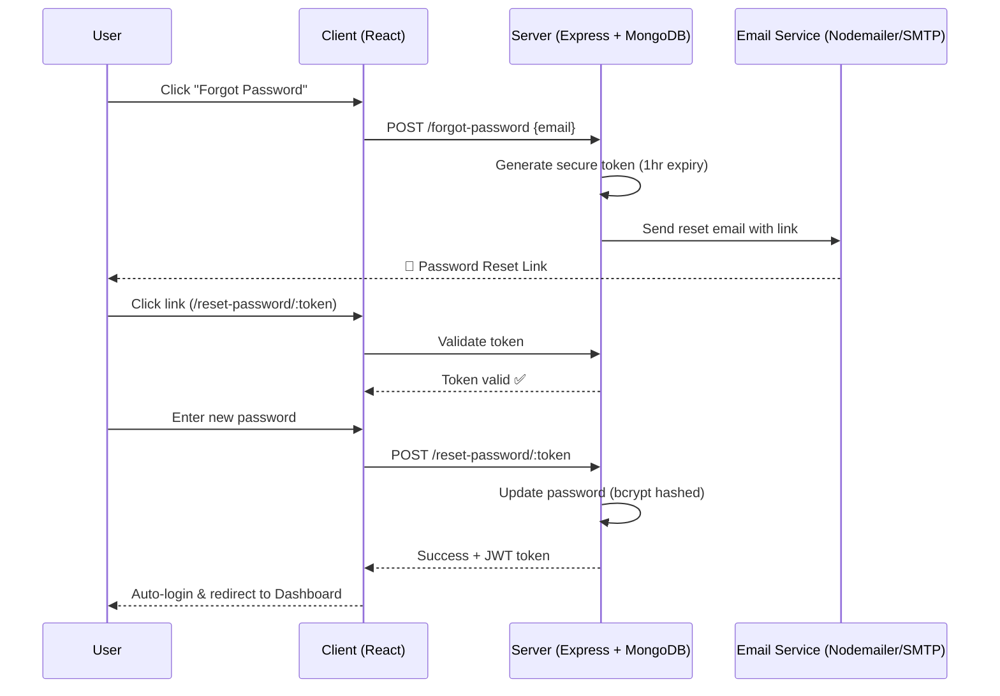

# 🧑‍💼 Agent Management System (MERN Stack)


A **MERN stack application** to manage agents, their records, distributed lists, and CSV uploads with a **complete authentication system** (signup, login, forgot password, reset password, profile management).

---

## ✨ Core Features

### 🔐 Authentication System
- ✔️ User Registration & Login  
- ✔️ Forgot/Reset Password via Email  
- ✔️ Profile Management (update info + change password)  
- ✔️ Secure JWT Authentication  
- ✔️ Mobile-Responsive UI  
- ✔️ Professional Email Templates  

### 🧑‍💼 Agent Management
- ✔️ Add new agents with detailed info  
- ✔️ View all agents in a clean dashboard  
- ✔️ Update or delete agents  
- ✔️ Upload agents via CSV Import  
- ✔️ Organize agents into Distributed Lists  
- ✔️ Role-based access control (Admin/User)  
- ✔️ Error handling & validation  

---

## 🔄 System Flow



---

## 🔁 Authentication Sequence (Forgot Password Flow)



---

## 📧 Email Configuration

Set up the following environment variables in your backend `.env` file:

```bash
EMAIL_HOST=smtp.gmail.com
EMAIL_PORT=587
EMAIL_USER=your-gmail@gmail.com
EMAIL_PASS=your-16-character-app-password
EMAIL_FROM=noreply@yourdomain.com
CLIENT_URL=http://localhost:5173
```

---

## 🧭 Navigation Structure

### Public Routes:
```
/login
/register
/forgot-password
/reset-password/:token
```

### Protected Routes:
```
/dashboard
  ├── Agents Tab (View All Agents)
  ├── Add Agent Tab (Add new agent)
  ├── Upload CSV Tab (Bulk import agents)
  ├── Distributed Lists Tab (Organize groups)
  └── Profile Tab (User info + password change)
```

---

## 📱 Responsive Design

- 📲 Mobile-friendly dashboards
- 👆 Touch-optimized forms & tables
- 📊 Easy-to-navigate data views
- ✅ Consistent design across devices

---

## ⚡ Tech Stack

- **Frontend:** React, React Hook Form, Toast Notifications
- **Backend:** Node.js, Express.js, Nodemailer, Bcrypt, Crypto
- **Database:** MongoDB + Mongoose
- **Auth:** JWT-based authentication
- **UI:** Responsive forms + tables for data management.

---

## 🚀 Getting Started

### 🔹 Clone Repository

```bash
git clone https://github.com/johnwesley755/agent-management-system.git
cd agent-management-system
```

### 🔹 Install Dependencies

```bash
# Install backend dependencies
cd backend
npm install

# Install frontend dependencies
cd ../frontend
npm install
```

### 🔹 Environment Setup

Create a `.env` file in the backend directory:

```bash
PORT=5000
MONGODB_URI=mongodb://localhost:27017/agent-management
JWT_SECRET=your-jwt-secret-key
JWT_EXPIRE=7d

EMAIL_HOST=smtp.gmail.com
EMAIL_PORT=587
EMAIL_USER=your-gmail@gmail.com
EMAIL_PASS=your-app-password
EMAIL_FROM=noreply@yourdomain.com
CLIENT_URL=http://localhost:5173
```

### 🔹 Run Application

```bash
# Run backend (from backend directory)
cd backend
npm run dev

# Run frontend (from frontend directory)
cd ../frontend
npm start
```

**Local Development:** http://localhost:5173

### 🌐 Live Demo
**Deployed Application:** https://agent-management-system-dun.vercel.app/

---

## 📁 Project Structure

```
agent-management-system/
├── backend/
│   ├── controllers/
│   ├── middleware/
│   ├── models/
│   ├── routes/
│   ├── utils/
│   ├── config/
│   └── server.js
├── frontend/
│   ├── public/
│   ├── src/
│   │   ├── components/
│   │   ├── pages/
│   │   ├── services/
│   │   ├── utils/
│   │   └── App.js
│   └── package.json
├── README.md
└── package.json
```

---

## 🔧 API Endpoints

### Authentication
- `POST /api/auth/register` - User registration
- `POST /api/auth/login` - User login
- `POST /api/auth/forgot-password` - Send reset email
- `POST /api/auth/reset-password/:token` - Reset password
- `GET /api/auth/profile` - Get user profile
- `PUT /api/auth/profile` - Update user profile
- `PUT /api/auth/change-password` - Change password

### Agents
- `GET /api/agents` - Get all agents
- `POST /api/agents` - Create new agent
- `GET /api/agents/:id` - Get agent by ID
- `PUT /api/agents/:id` - Update agent
- `DELETE /api/agents/:id` - Delete agent
- `POST /api/agents/upload-csv` - Bulk upload via CSV

### Distributed Lists
- `GET /api/lists` - Get all lists
- `POST /api/lists` - Create new list
- `PUT /api/lists/:id` - Update list
- `DELETE /api/lists/:id` - Delete list

---

## 🛡️ Security Features

- **Password Hashing:** Bcrypt with salt rounds
- **JWT Authentication:** Secure token-based auth
- **Input Validation:** Server-side validation for all inputs
- **CORS Protection:** Configured for specific origins
- **Secure Headers:** Helmet.js for security headers

---

## 🤝 Contributing

1. Fork the repository
2. Create your feature branch (`git checkout -b feature/AmazingFeature`)
3. Commit your changes (`git commit -m 'Add some AmazingFeature'`)
4. Push to the branch (`git push origin feature/AmazingFeature`)
5. Open a Pull Request

---

## 👨‍💻 Author

**John Wesley**
- GitHub: [@johnwesley755](https://github.com/johnwesley755)
- LinkedIn: [John Wesley](https://linkedin.com/in/johnwesley755)

---

## ✅ Conclusion

The Agent Management System provides:
- ✔️ **Secure Authentication System**
- ✔️ **Full CRUD Agent Management**
- ✔️ **Bulk CSV Uploads**
- ✔️ **Distributed List Management**
- ✔️ **Profile & Password Controls**
- ✔️ **Mobile-Friendly Dashboards**

---

<div align="center">
  <strong>⭐ Star this repo if you found it helpful! ⭐</strong>
</div>